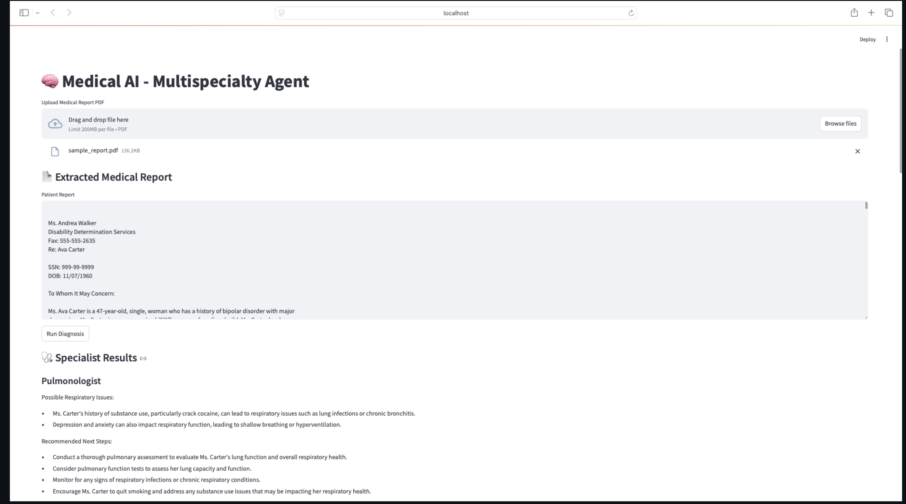

# Multimodal AI Agent for Automated Medical Report Analysis

## Project Overview

This project leverages Multimodal AI Agents to analyze medical reports from multiple specialist perspectives, including:

- Cardiology  
- Psychology  
- Pulmonology  
- Neurology  
- Endocrinology  
- Immunology  

Using LangChain, OpenAI GPT models, and PyMuPDF, the system extracts insights from a PDF medical report, processes it through multiple AI-powered agents, and generates a comprehensive multidisciplinary diagnosis.

---

## Features

- Multimodal AI Agents for different medical specialties  
- Automated PDF medical report extraction using PyMuPDF  
- Parallel processing of multiple AI agents using ThreadPoolExecutor  
- Final diagnosis generation by a Multidisciplinary AI Agent  
- Structured output storage for easy reference  

---

## Tech Stack

- Python (core logic and parallel processing)  
- LangChain (AI agent orchestration)  
- OpenAI GPT-3.5 Turbo (AI-powered diagnosis)  
- PyMuPDF (fitz) (PDF text extraction)  
- ThreadPoolExecutor (concurrent agent execution)  
- JSON and File Handling (structured result storage)  

---

## System Architecture

### 1. PDF Extraction Module
- Reads and parses medical report PDFs  
- Extracts structured text using PyMuPDF  

### 2. Specialist AI Agents
Each agent is responsible for analyzing the report from a specific domain perspective:
- Cardiology Agent  
- Psychology Agent  
- Pulmonology Agent  
- Neurology Agent  
- Endocrinology Agent  
- Immunology Agent  

These agents run in parallel using ThreadPoolExecutor to improve efficiency.

### 3. Multidisciplinary Diagnosis Agent
- Aggregates all specialist insights  
- Synthesizes findings into a comprehensive diagnosis  
- Produces structured output  

### 4. Output Storage
- Saves final diagnosis as a structured text or JSON file  
- Enables easy review and traceability  

---

## How It Works

1. Extract Text from PDF  
   The system reads a medical report from a PDF file.

2. Run AI Agents  
   Each specialist agent analyzes the report according to its domain knowledge.

3. Generate Specialist Insights  
   Each agent produces structured findings and observations.

4. Multidisciplinary Analysis  
   A final AI agent synthesizes all specialist outputs into a unified diagnosis.

5. Store the Output  
   The final diagnosis is saved as a text file for further review.

---

## Streamlit UI

### Home Screen

### Output Report

---

## Future Improvements

- Integration with electronic health record (EHR) systems  
- Support for multimodal inputs such as medical images and lab reports  
- Fine-tuning domain-specific medical language models  
- Deployment as a secure web-based healthcare application  
- Enhanced explainability for clinical transparency  

---

## Disclaimer

This system is intended for research and educational purposes only. It is not a substitute for professional medical advice, diagnosis, or treatment.
